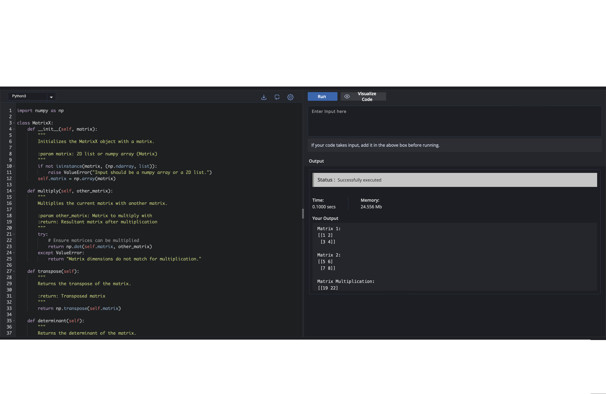

# MatrixX
MatrixX is a Python toolkit for essential Linear Algebra operations, including matrix manipulation, determinant calculation, and basic decomposition. Perfect for mathematical computations in data science, machine learning, and scientific applications.


🚀 Features

- Matrix operations: addition, subtraction, multiplication
- Determinant calculation
- Matrix inversion
- Basic matrix decompositions (LU, SVD)

## 🛠️ Usage

### 1. **Matrix Determinant Calculation**

To calculate the determinant of a matrix, you can use the `determinant` function.

```python
# Importing necessary libraries
from src.matrix_ops import determinant
import numpy as np

# Example matrix
A = np.array([[2, 3], [1, 4]])

# Calculating and printing the determinant
print("Determinant:", determinant(A))

Expected output:
Determinant: 5.0

```

## 📸 Preview

The screenshot below shows a snippet of the code. You can check out the full source in the repository.




## 📜 License

This project is licensed under the MIT License - see the [LICENSE](LICENSE) file for details.
